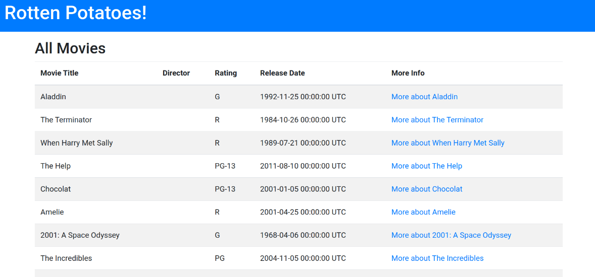

# Parte 1: El ciclo de prueba de aceptación- prueba unitaria
Ejecutamos ``bundle install --without production`` para asegurar que las gemas sean instaladas.
Tambien ejecutamos la migracion y el cargamos los datos de la `seed`:

Y vemos que nuestra web funciona:

## Agrega un campo Director a Movies (1 punto)
Crea y aplica una migración que agregue el campo director a la tabla de películas. El campo director
debe ser una cadena que contenga el nombre del director de la película
Ejecutamos ``bundle exec cucumber`` y vemos que nos aparece en la consola los test que debemos completar:

## Agregamos la columna usando ActiveRecord:
Agregaremos la columna Director a nuestra migración usando ``add_column`` de ActiveRecord::Migration creando la migracion usando el siguiente comando `bundle exec rails generate migration AddDirectorToMovies director:string`:

Y ejecutamon la migracion:


## Pregunta:
Claramente, ahora que se ha agregado un nuevo campo, tendrás que modificar las Vistas para
que el usuario pueda ver e ingresar valores para ese campo. ¿También tienes que modificar el
archivo del modelo para que "se note" el nuevo campo? . Muestra con ejemplos tu respuesta
## Respuesta
Ahora necesitamos modificar nuestras vistas para que se vea la nueva columna que hemos creado con la migracion:
Modificamos nuestro `index.html.erb` añadiendo el campo ``Director`` que falta a la plantilla:
```erb
<!--  This file is app/views/movies/index.html.erb -->
<h2>All Movies</h2>

<%#  Part 2: Start here... %>

<table class="table table-striped col-md-12" id="movies">
  <thead>
    <tr>
      <th>Movie Title</th>
      <th>Director</th>
      <th>Rating</th>
      <th>Release Date</th>
      <th>More Info</th>
    </tr>
  </thead>
  <tbody>
    <% @movies.each do |movie| %>
      <tr>
        <td>
          <%= movie.title %>
        </td>
        <td>
          <%= movie.director %>
        </td>
        <td>
          <%= movie.rating %>
        </td>
        <td>
          <%= movie.release_date %>
        </td>
        <td>
          <%= link_to "More about #{movie.title}", movie_path(movie) %>
        </td>
      </tr>
    <% end %>
  </tbody>
</table>
<%= link_to 'Add new movie', new_movie_path, :class => 'btn btn-primary' %>

```
Y podemos ver la nueva columna creada:

Y tambien los test pasados por `cucumber`:


Tambien tenemos que modificar las vistas al momento acceder a los detalles de una película:


# Parte 2: Ruby on Rails
## Pregunta 1 (1 punto)
¿Por qué la abstracción de un objeto de formulario pertenece a la capa de presentación y no a la capa
de servicios (o inferior)?
## Respuesta:
Los formularios son una parte integral de la interfaz de usuario y están directamente relacionados con la presentación de datos al usuario. La capa de presentación se encarga de manejar la interacción con el usuario y de mostrar la información de una manera comprensible. Y además los formularios suelen contener lógica de validación y formateo de datos, lo cual es la responsabilidad de la capa de presentación. La capa de servicios o inferior se centra más en la lógica empresarial y en la manipulación de los datos en las bases de datos, por lo que la abstracción de un objeto de formulario no estaria relacionada en esta capa.
## Pregunta 2 (1 punto)
¿Cuál es la diferencia entre autenticación y autorización?
## Respuesta:
La ``autenticación`` y la ``autorización`` son dos conceptos diferentes pero relacionados en el concepto de la seguridad informática:

La ``autenticación`` se refiere al proceso de verificar la identidad de un usuario. Se utiliza para confirmar que un usuario es quien dice ser. Esto generalmente se logra mediante la presentación de credenciales, como un nombre de usuario y una contraseña.

La ``autorización`` se refiere a los permisos y privilegios que se le otorgan a un usuario una vez que ya esta autenticado. La autorización determina qué es lo que puede y no acceder un usuario específico. Por ejemplo, un usuario autenticado puede tener permisos para leer, escribir o eliminar ciertos datos o para acceder a ciertas áreas de una aplicación.
## Pregunta 3 (2 puntos)
Un middleware es un componente que envuelve la ejecución de una unidad central (función) y puede
inspeccionar y modificar datos de entrada y salida sin cambiar su interfaz. El middleware suele estar
encadenado, por lo que cada uno invoca al siguiente y sólo el último de la cadena ejecuta la lógica
central. El encadenamiento tiene como objetivo mantener el middleware pequeño y de un solo
propósito.
### Pregunta 
¿Qué pasa si omite el middleware de Rack y se pasa la solicitud al enrutador directamente (Rails.application.routes.call(request))? 
### Respuesta:
Si se omite el middleware de Rack y se pasa la solicitud directamente al enrutador ``(Rails.application.routes.call(request))``, se estaría evitando el procesamiento de los middlewares en la cadena. Esto haria que los middlewares que se encargan de tareas como la autenticación o el registro no se ejecutarían.
### Pregunta 
¿Qué pasa si se omitie el enrutador y llamar a una acción del controlador de inmediato (por ejemplo, ``PostsController.action(:index).call(request))?``
### Respuesta: 
Si se omite el enrutador y se llama directamente a una acción del controlador ``(por ejemplo, PostsController.action(:index).call(request))``, se estaría evitando la ejecución de todo el enrutamiento de la solicitud. Esto significa que la solicitud no pasaría por el enrutador para determinar qué acción del controlador debe ejecutarse en función de la ``URL`` y los parámetros de la ``HTTP request``.

En vez de eso, se estaría llamando directamente a la acción del controlador especificada. Sin embargo, esto significa que se omitirían las funcionalidades proporcionadas por el enrutador, como la generación de rutas, el manejo de parámetros y el enrutamiento basado en condiciones.
### Pregunta 
La gema trace_location (https://github.com/yhirano55/trace_location) es el pequeño ayudante de un
desarrollador curioso. Su objetivo principal es aprender qué sucede detrás de escena de las API simples
proporcionadas por librerías y frameworks. Te sorprenderá lo complejos que pueden ser los aspectos
internos de las cosas que das por sentado (por ejemplo, user.save en Active Record).
Diseñar API simples que resuelvan problemas complejos es un verdadero dominio del desarrollo de
software. En el fondo, esta joya utiliza la API TracePoint de Ruby (https://rubyapi.org/3.2/o/tracepoint),
una poderosa herramienta de introspección en tiempo de ejecución.
Utiliza trace_location para realizar algunos experimentos y analizar los resultados.
### Respuesta:
Podemos realizar un seguimiento del proceso de validación del registro:

```ruby
book = Book.new(title: "My Book Title")
TraceLocation.trace(match: /activerecord/) { book.validate }
```
Y podemos observar en el ``.log`` el proceso de validacion del regtro:


## Pregunta 4 (2 punto)
Prepara un one-liner (https://linuxcommandlibrary.com/basic/oneliners) de Unix para mostrar los N
primeros archivos complejos de Ruby usando Flog. 
## Respuesta

```bash
find . -name "*.rb" -exec flog {} + | sort --k 2 -r | head -n 4
```
```bash
OUTPUT:
```

El comando ``find`` buscará todos los archivos con extensión ".rb" en el directorio actual y sus subdirectorios, ejecutará el comando flog en cada archivo (`-exec flog {} +`) y luego ordenará los resultados según la columna de complejidad en orden descendente (`sort -k 2 -r`). Al final, mostrará los primeros 4 resultados (`head -n 4`).
En este caso simple tenemos la complejidad de 379.1 del main y un 934.9 total segun el ordenamiento descendente de flog.
## Parte 3: JavaScript
### Pregunta1 (2 puntos)
Crea varias funciones que te permitirán interactuar con las cookies de la página, incluida la lectura de un
valor de cookie por nombre, la creación de una nueva cookie usando un nombre y su configuración para
una cantidad determinada de días, y la eliminación de una cookie.
Configura tu página web y, en el código JavaScript, genera el valor de documento.cookie que debería
estar en blanco. Intenta eliminar un cookie por su nombre.
### Respuesta
Vamos a usar un ejemplo muy simple con el siguiente codigo para ver las funcionalidades que se nos pide:

```html
<!DOCTYPE html>
<html>
<head>
  <title>Prueba de Cookies</title>
  <script>
    function getCookie(name) {
    const cookieName = `${name}=`;
    const decodedCookie = decodeURIComponent(document.cookie);
    const cookieArray = decodedCookie.split(';');
  
    for (let i = 0; i < cookieArray.length; i++) {
      let cookie = cookieArray[i];
      while (cookie.charAt(0) === ' ') {
        cookie = cookie.substring(1);
      }
      if (cookie.indexOf(cookieName) === 0) {
        return cookie.substring(cookieName.length, cookie.length);
      }
    }
  
    return '';
  }
  
  function setCookie(name, value, days) {
    const date = new Date();
    date.setTime(date.getTime() + (days * 24 * 60 * 60 * 1000));
    const expires = `expires=${date.toUTCString()}`;
    document.cookie = `${name}=${value};${expires};path=/`;
  }
  
  function deleteCookie(name) {
    document.cookie = `${name}=;expires=Thu, 01 Jan 1970 00:00:00 UTC;path=/;`;
  }
  

    function configurePage() {

      setCookie('miCookie', 'valor de ejemplo', 7); // Nombre de la cookie: 'miCookie', Valor: 'valor de ejemplo', Duración: 7 días

      const cookieValue = getCookie('miCookie');
      console.log('Valor de la cookie:', cookieValue);

      deleteCookie('miCookie');
      console.log('Cookie eliminada');
    }
    console.log(document.cookie);
    configurePage();
  </script>
</head>
<body>
  <h1>Prueba de Cookies</h1>
</body>
</html>
```

El código proporciona una funcionalidad básica para trabajar con cookies en una página web utilizando ``JavaScript``:

``getCookie(name):`` Busca una cookie específica por su nombre en la cadena ``document.cookie``. Si encuentra la cookie, devuelve su valor; de lo contrario, devuelve una cadena vacía.

``setCookie(name, value, days):`` Esta función crea una nueva cookie con un nombre, un valor y una duración específica en días. Establece la cookie en el navegador asignando una cadena formateada adecuadamente a ``document.cookie.``

``deleteCookie(name):`` Esta función elimina una cookie específica por su nombre. Establece la cookie en blanco y le asigna una fecha de expiración en el pasado para que el navegador la elimine.

y podemos comprobar nuestra creacion de coockies y nuestro ``docuemnt.cookie``:

## Pregunta 2 (1 punto)
Este ejercicio es un ejemplo de una estructura de formulario típica en la que se verifican los valores
ingresados en el formulario y se validan antes de enviar el contenido. Se devuelve una respuesta al
usuario si los valores no cumplen con los criterios de validación en el código. Utiliza el siguiente HTML y
CSS como plantilla inicial:
```html
<!doctype html>
<html>

<head>
    <title>Curso CC-3S2</title>
    <style>
        .hide {
            display: none;
        }

        .error {
            color: red;
            font-size: 0.8em;
            font-family: sans-serif;
            font-style: italic;
        }

        input {
            border-color: #ddd;
            width: 400px;
            display: block;
            font-size: 1.5em;
        }
    </style>
</head>

<body>
    <form name="myform">
        Email:
        <input type="text" name="email"> <span class="error"></span>
        <br> Password:
        <input type="password" name="password"> <span class="error"></span>
        <br> User Nombre:
        <input type="text" name="userName"> <span class="error"></span>
        <br>
        <input type="submit" value="Sign Up">
    </form>
    <script>
    </script>
</body>
</html>
```
Seleccionar todos los elementos de la página y configurarlos como objetos JavaScript:
```javascript
        const form = document.querySelector('form[name="myform"]');
        const emailInput = document.querySelector('input[name="email"]');
        const passwordInput = document.querySelector('input[name="password"]');
        const userNameInput = document.querySelector('input[name="userName"]');
        const errorElements = document.querySelectorAll('.error');
```
Agregar un detector de eventos para enviar y capturar el clic
```javascript
        form.addEventListener('submit', function (event) {
            event.preventDefault(); // Evitar la acción predeterminada del formulario
```
Recorrer todos los elementos de la página con la clase "error" y agregar la clase "ocultar"
```javascript
            errorElements.forEach(function (element) {
                element.classList.add('ocultar');
            });
```
Utilizar una expresión regular para validar el formato del correo electrónico
```javascript
            const emailRegex = /^\w+([\.-]?\w+)*@\w+([\.-]?\w+)*(\.\w{2,3})+$/;
            const emailValue = emailInput.value;
```
Validar el campo de correo electrónico
```javascript
            if (!emailRegex.test(emailValue)) {
                handleError(emailInput, 'El correo electrónico no es válido');
            }
```
Validar el campo de contraseña
```javascript
            const passwordValue = passwordInput.value;
            const passwordRegex = /^[a-zA-Z0-9]+$/;

            if (!passwordRegex.test(passwordValue) || passwordValue.length < 3 || passwordValue.length > 8) {
                handleError(passwordInput, 'La contraseña debe contener solo letras y números y tener entre 3 y 8 caracteres');
            }
```
Verificar si hay errores antes de enviar el formulario
```javascript
            if (!document.querySelector('.error:not(.ocultar)')) {
                const formData = {};
```
Agregar valores al objeto formData recorriendo todas las entradas
```javascript
                formData.email = emailValue;
                formData.password = passwordValue;
                formData.userName = userNameInput.value;
```
Enviar el objeto formData
```javascript
                console.log('Datos del formulario:', formData);
            }
        });
```
Si alguno de estos requisitos no se cumple, se llama a la función handleError para mostrar el mensaje de error correspondiente. Finalmente, se verifica si hay algún error antes de enviar el formulario y, si no hay errores, se crea un objeto ``formData`` que contiene los valores de las entradas del formulario y se muestra en la consola.
### Ejemplo de error 
Con un email inválido:

### Ejemplo correcto
Con todos los valores válidos


## Parte 4: Pruebas y Rspec (3 puntos)
Aqui vamos a generar un nuevo proyecto `tennis` usando ``rails new tennis``; para probar nuestros test y lograr pasarlos, tambien la gema ``rspec-rails`` al Gemfile.

Usamos el comando ``rails generate rspec:install`` para crear nuestra carpeta con los test.
Nos piden agregar la clase ``TennisScorer`` para usarla en los test:

```ruby
RSpec.describe "TennisScorer" do
 describe "puntuación básica" do
 it “empieza con un marcador de 0-0"
 it “ hace que el marcador sea 15-0 si el sacador gana un punto"
 it "hace que el marcador sea 0-15 si el receptor gana un punto"
 it "hace que el marcador sea 15-15 después de que ambos ganen un punto"
 end
end

```
### 1. Ejecuta esta especificación usando el comando rspec.

Completamos la clase ``tennis_test`` para convertir el lenguaje humano en lenguaje de codigo:

```ruby
require_relative "TennisScorer"
RSpec.describe "TennisScorer" do
    before(:each) do
        @tennis_scorer = TennisScorer.new
    end
    describe "puntuación básica" do
        it "empieza con un marcador de 0-0" do
            expect(@tennis_scorer.score).to eq("0-0")
        end
    
        it "hace que el marcador sea 15-0 si el sacador gana un punto" do
            @tennis_scorer.punto(:saca)
            expect(@tennis_scorer.score).to eq("15-0")
        end
    
        it "hace que el marcador sea 0-15 si el receptor gana un punto" do
            @tennis_scorer.punto(:recibe)
            expect(@tennis_scorer.score).to eq("0-15")
        end
    
        it "hace que el marcador sea 15-15 después de que ambos ganen un punto" do
            @tennis_scorer.punto(:recibe)
            @tennis_scorer.punto(:saca)
            expect(@tennis_scorer.score).to eq("15-15")
        end
    end
end
```

Ejecutamos el archivo ``tennis_test.rb`` usando ``rspec tennis_test.rb``.:

Como ya reconocio nuestro archivo de test, podemos completar nuestra clase ``TennisScorer`` de tal manera que pase todos los test:

``SIGTE_PUNTO`` es un hash que mapea los valores del puntaje actual a su representación en el juego de tenis. Por ejemplo, SIGTE_PUNTO[0] devuelve 0, SIGTE_PUNTO[1] devuelve 15, y así sucesivamente.

``OTRO_JUGADOR`` es un hash que mapea el jugador actual al otro jugador. Por ejemplo, OTRO_JUGADOR[:saca] devuelve :recibe, y viceversa.

``El método initialize ``inicializa el marcador con un puntaje de 0 para ambos jugadores.

``El método score`` calcula el puntaje del juego para un jugador dado. Toma un parámetro opcional player que especifica el jugador para el cual se calculará el puntaje. Por defecto, se asume que el jugador es el que saca. El método realiza una serie de verificaciones condicionales para determinar el resultado del juego y devuelve un string que representa el puntaje resultante de acuerdo a los test que nos dan, por ejemplo hace que el marcador sea 15-0 si el sacador gana un punto.
``El método punto`` incrementa el puntaje del jugador especificado en 1.

Al hacer el test de la clase ``TennisScorer``, podemos ver que todos los test pasaron correctamente:


Ahora vamos a implementar algunos nuevos test que tambien deberia pasar:

```ruby
it "40-0 después de que el sacador gane tres puntos" do
            @tennis_scorer.punto(:saca) 
            @tennis_scorer.punto(:saca) 
            @tennis_scorer.punto(:saca) 
            expect(@tennis_scorer.score).to eq("40-0")
          end
          
          it "W-L después de que el sacador gana cuatro puntos" do
            @tennis_scorer.punto(:saca)
            @tennis_scorer.punto(:saca)
            @tennis_scorer.punto(:saca)
            @tennis_scorer.punto(:saca)
            expect(@tennis_scorer.score).to eq("W-L")
          end
        
          it "L-W después de que el receptor gane cuatro puntos" do
            @tennis_scorer.punto(:recibe)
            @tennis_scorer.punto(:recibe)
            @tennis_scorer.punto(:recibe)
            expect(@tennis_scorer.score).to eq("0-40")
          end
          
          it "Deuce después de cada uno gana tres puntos" do
            @tennis_scorer.punto(:saca) 
            @tennis_scorer.punto(:saca) 
            @tennis_scorer.punto(:saca) 
            @tennis_scorer.punto(:recibe)
            @tennis_scorer.punto(:recibe)
            @tennis_scorer.punto(:recibe)
            expect(@tennis_scorer.score).to eq("DEUCE")
          end
          
          it "El sacador con ventaja después de cada uno gana tres puntos y el sacador obtiene uno más" do
            @tennis_scorer.punto(:saca) 
            @tennis_scorer.punto(:saca) 
            @tennis_scorer.punto(:saca) 
            @tennis_scorer.punto(:recibe) 
            @tennis_scorer.punto(:recibe) 
            @tennis_scorer.punto(:recibe) 
            @tennis_scorer.punto(:saca)
            expect(@tennis_scorer.score).to eq("El sacador tiene ventaja")
          end
    end
```

Y vemos como con la logica implementada tambien logran pasar estos test:


